# **PHISHING EMAIL SERVER SETUP INSTRUCTIONS**    
**NOTE BEFORE BEGINNING THIS PROCESS LOG INTO THE DOMAIN MANAGEMENT PORTAL  
(AWS, AZURE, DIGITAL OCEAN)  AND NAVIGATE TO YOUR DNS SETTINGS. THIS EXAMPLE  
USES AWS AND ALL THE SCREENSHOTS WERE CREATED USING IT. ADJUST ACCORDINGLY FOR  
YOUR PARTICULAR DOMAIN MANAGEMENT PROVIDER. YOU WILL BE EDITING THE SETTINGS  
FOR THE DOMAIN YOU ARE USING THROUGHOUT THIS PROCESS.**  

### STEP 1:  Run the email setup script.  
```
sudo ./emailServer.sh 'example.com'
```
-	If the server has a preexisting database, run the script with the ‘clean’  
argument. The clean argument removes all previous databases and reinstalls  
it cleanly    

```
sudo ./emailServer.sh ‘example.com’ ‘clean’
```
-	Make sure to answer the questions appropriately when creating the SSL  
certificate so that the cert matches the context of the domain you’re using 
-   Once the script finishes check the status of the dockers and make sure  
that from within the Domain Management Portal **(in this case AWS Console)**    
open firewall access to ports 80, 443, 25, 143, and 587 on your VPS.  
```
sudo docker ps -a  
```  

```  
ubuntu@ip-172-31-22-180:~$ sudo docker ps -a  
IMAGE                         PORTS  
onlyoffice/communityserver   0.0.0.0:80->80/tcp, 0.0.0.0:443->443/tcp, 3306/tcp, 5280/tcp, 9865-9866/tcp, 9871/tcp, 9882/tcp, 9888/tcp  
onlyoffice/mailserver        0.0.0.0:25->25/tcp, 0.0.0.0:143->143/tcp, 3306/tcp, 0.0.0.0:587->587/tcp, 8081/tcp  
onlyoffice/documentserver    80/tcp, 443/tcp  
mysql:5.7                    3306/tcp  
ubuntu@ip-172-31-22-180:~$ 
```

### STEP 2:  Quickly browse to the public IP address of the VPS to set up your password. Your server is unsecured and open to the public until you do steps 3 & 4 !!  
-	Use https:// your.public.ip.addr  

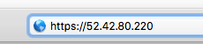

### STEP 3:  Enter a strong password to be used for the administrative logon  
  
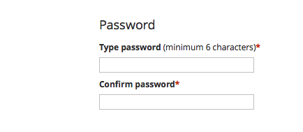

### STEP 4:  Create the email address for registration and the administration  

- Use the domain that was used during the installation, check the box  
to agree to terms of use, and click continue  

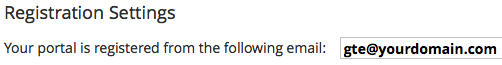

### STEP 5:  Select Mail Server to begin domain validation

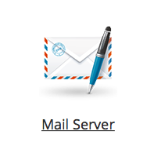

### STEP 6:  Click set up first domain and enter the domain used during installation

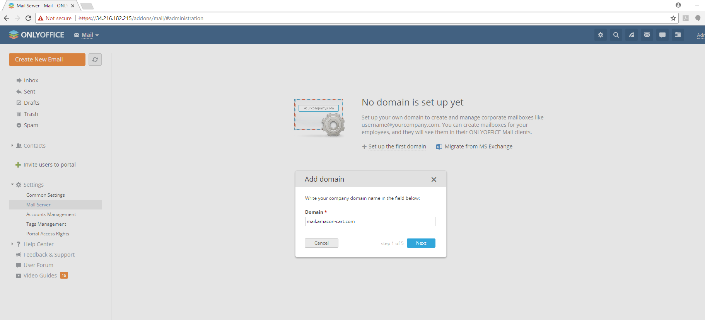

### STEP 7:  Add TXT record for ownership validation
- Go to domain registrar's site and configure DNS settings to include the  
  TXT record given to you If you receive an error after hitting submit saying  
  that the  Domain could not be validated check your NS record's TTL value.  
  For example the default NS TTL for AWS is 172800 which is equal to 48 hours.  
  Unless you want to wait that long edit the TTL for the NS and change to 30  
  seconds.  Then open a Linux terminal and type: **dig -t ANY yourdomain.com**   
  Continue to check dig every 10-20 seconds until the new TXT records show  
  up then go back to your web browser and try the validation again. Once  
  you've validated, go back and change the TTL value back to the original  
  value.  (you don't want your TTL's updating every 30 secs)  
  If the validation continuously fails try removing the **@** from the  
  **name** field of your DNS TXT record, waiting appropriate time, then  
  trying again.   
  
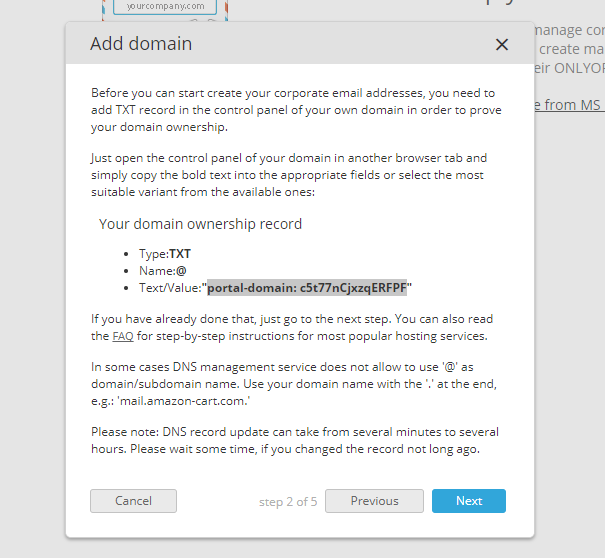  

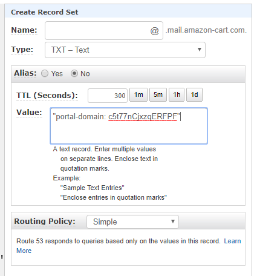  

### STEP 8:  Add MX record
- In the domain management portal create a new DNS record  
-	Name it according to the prompt given by OnlyOffice.  
  * the example here it was left blank
-	Make it a type **MX** with the domain name as the value,
	with priority 0  

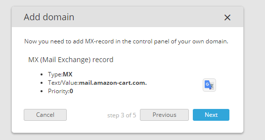  
  
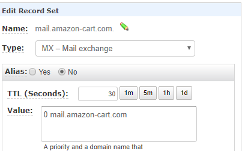  

### STEP 9:  Add SPF record  

- In the domain management portal create a new DNS record    
- Name it according to the prompt given by OnlyOffice.  
  * the example here the **@** was used  
**_AWS has an option for a SPF but use a TXT record_**  
- Copy **Value** data from the OnlyOffice prompt and use it to set the value  
in the **Value** section of the Domain management portal

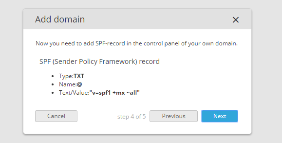

### STEP 10:  Add DKIM record
- In the domain management portal create a new DNS record
	* Unless there is an option for type DKIM, use a TXT record.  
- Name it according to the prompt given by OnlyOffice.  
  * the example here is **dkim_domainkey**  
- Just as you've done in the prior steps, copy the DKIM key value  
**(ensuring to copy it all)** and paste it into the value section  
of Domain management portal  

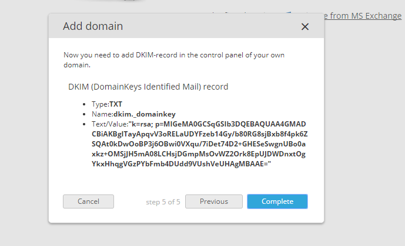  

### STEP 11:  Ensure all settings were validated  

- In the top left if any of the settings failed during validation you will  
see in red "Please check DNS settings".  
- Click the hyperlink and it will show which setting failed to validate.  
  * If any failed correct the setting and reverify.  
  * **You may have to remove the @ sign from the name field of the SPF record if it doesn't verify**  
- Once all settings are good and have been validated it'll resemble the image below.  

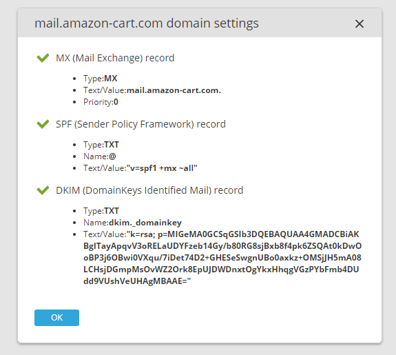

### STEP 12: Add A Record  
- In the domain mgmt portal create a new DNS A Record  
  * Leave the name field blank  
  * Change the Type to "A"  
  * Place the IP Address in the Value field  

### STEP 13: Add PTR Record
- In the domain mgmt portal create a new DNS PTR Record  
  * Leave the name field blank  
  * Change the Type to "PTR"  
  * Place the domain name in the Value field    
  
### STEP 14: Add DMARC Record
- In the domain mgmt portal create a new DNS DMARC Record  
  * Place \_dmarc in the name field  
  * Change the Type to TXT  
  * Place "v=DMARC1;p=none" into the Value field    

### STEP 15: Add Mailbox
- Next go back to the Mail Management Portal and click add a new mailbox  
  * **Sender Name should be the Name of the person you are Phishing as**  
  * **Mailbox address** should be the email address you want associate with the sender name
  * **Mailbox user** is the OpenOffice account that will be using the address to phish  
  * When Mailbox user is clicked there should be a list of potential users, select one  

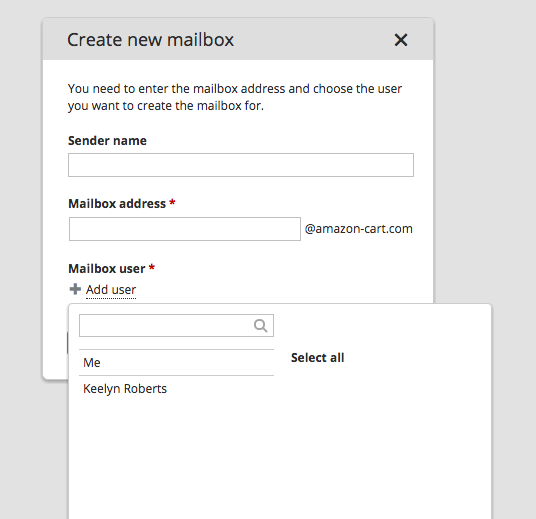  

### STEP 16: Test Email 
- Once you've finished all the settings, use an online resource that checks all of your email settings  
to test for spam characteristics
  * Browse to **https://mail-tester.com**  
  * Copy the email address that mail-tester.com gives you and then go back to OpenOffice  
  * Create a new Email, then enter it into the **To:** field of your test email  
  * Add a subject and enter some sentences into the email section  
  * Send the email and check the sent folder to make sure it sent  
  * Finally go back to the mail-tester.com site and validate results    

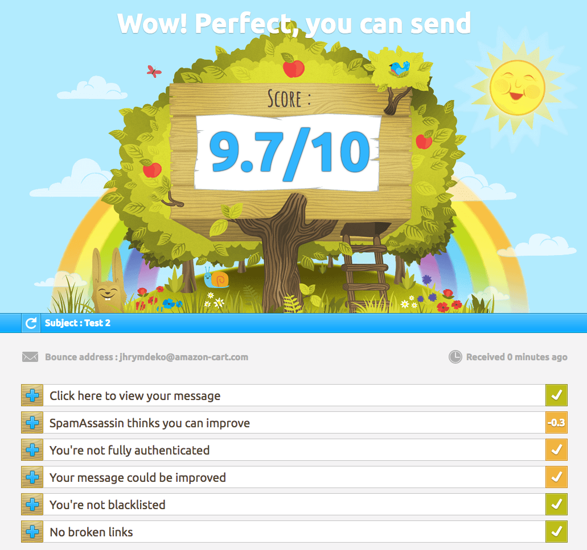  

